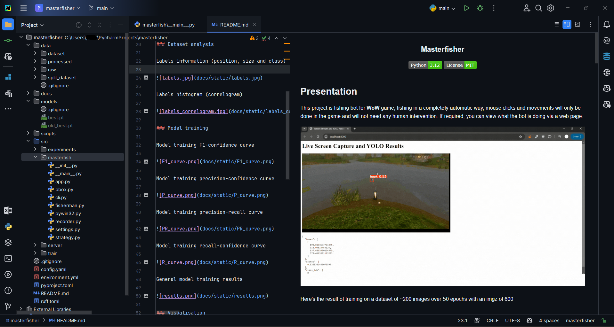
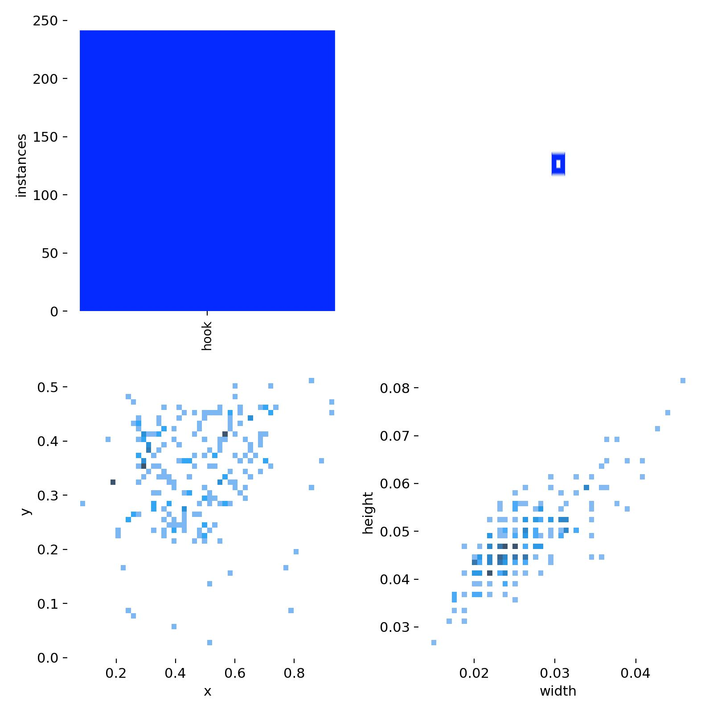
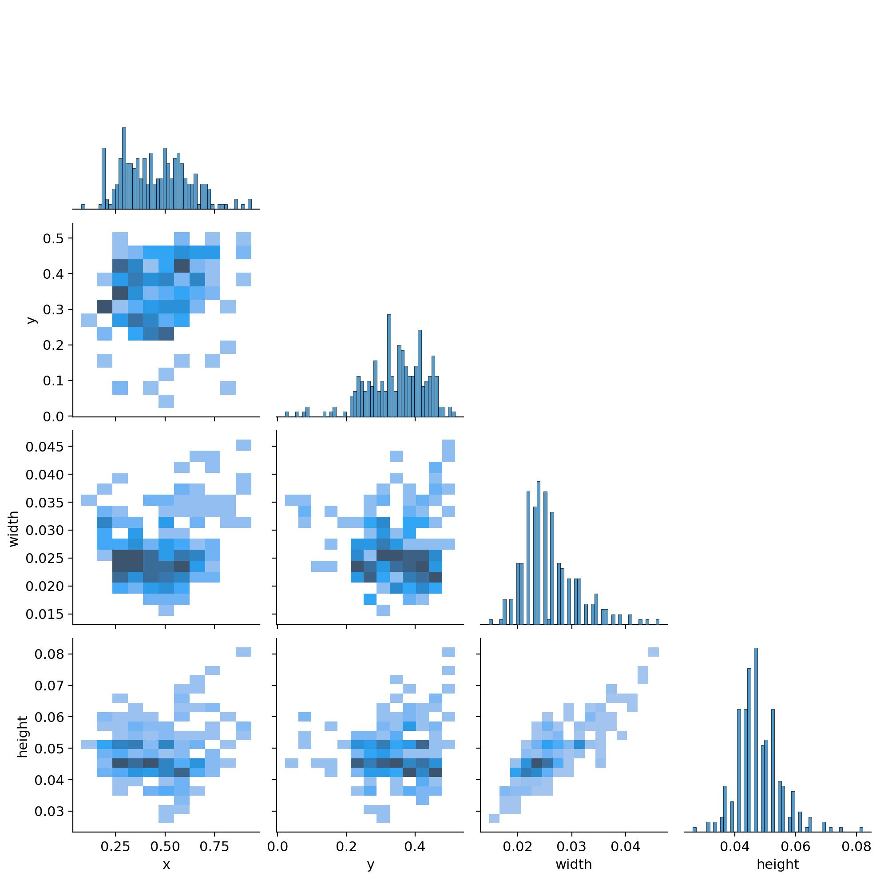
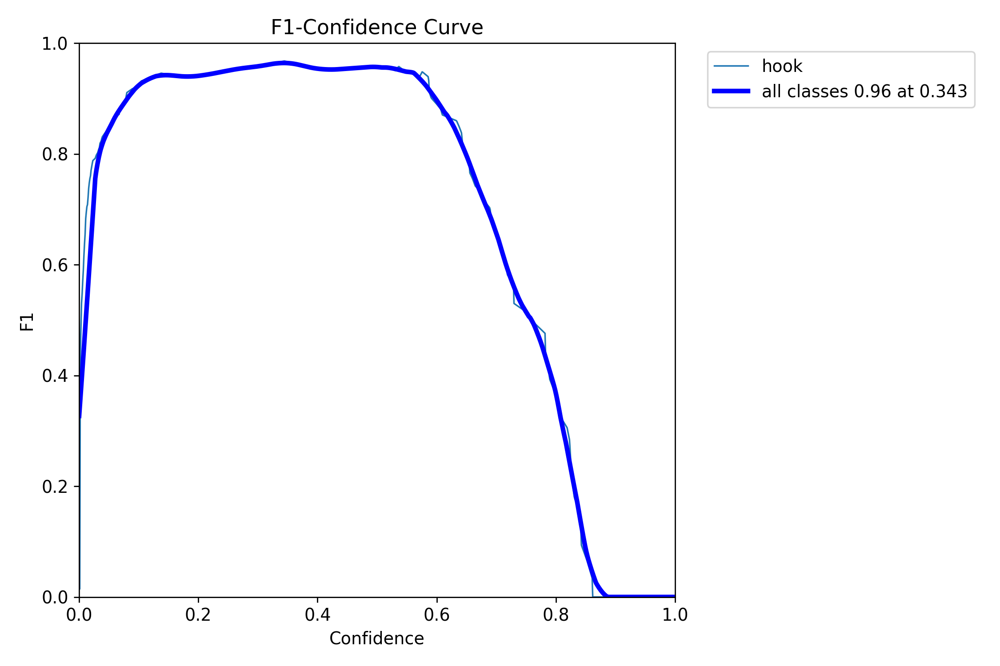
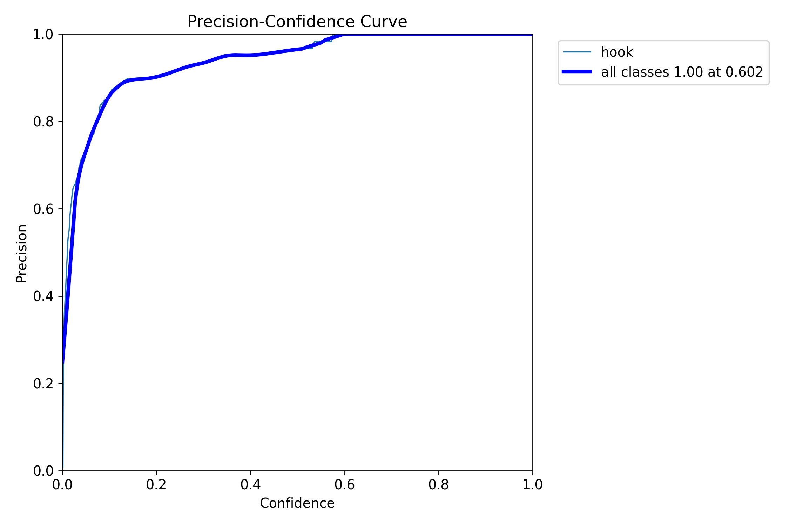
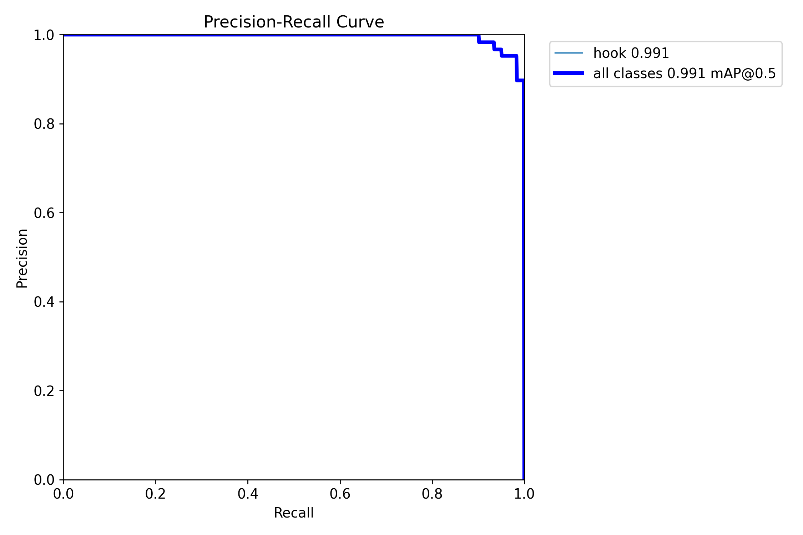
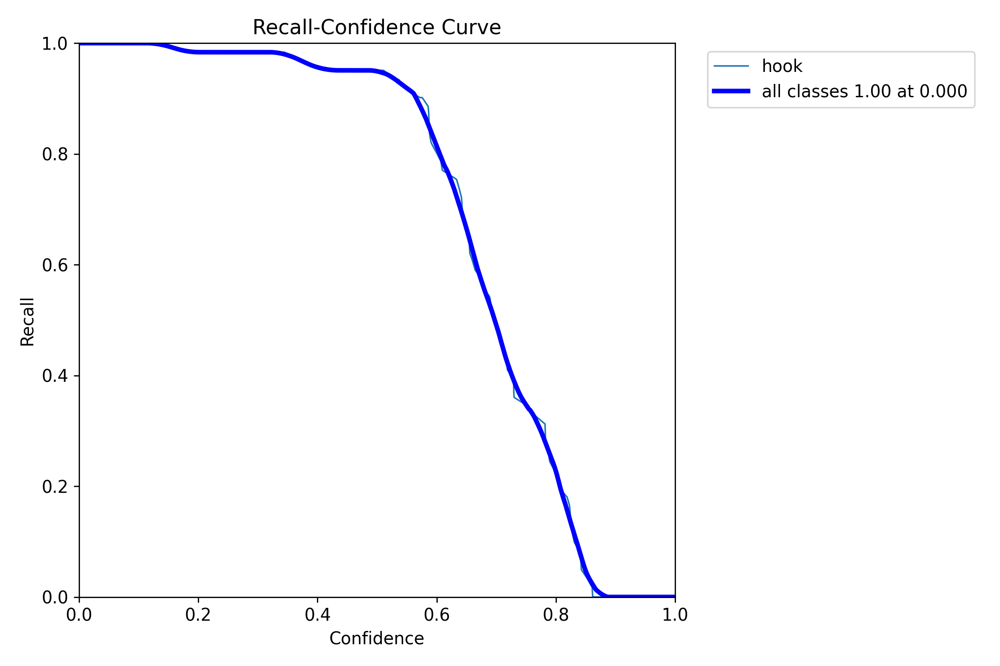
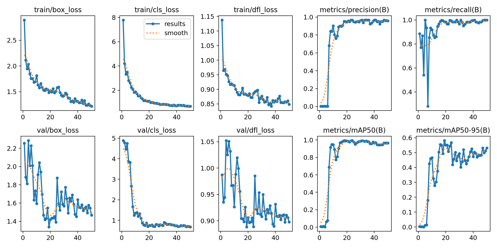
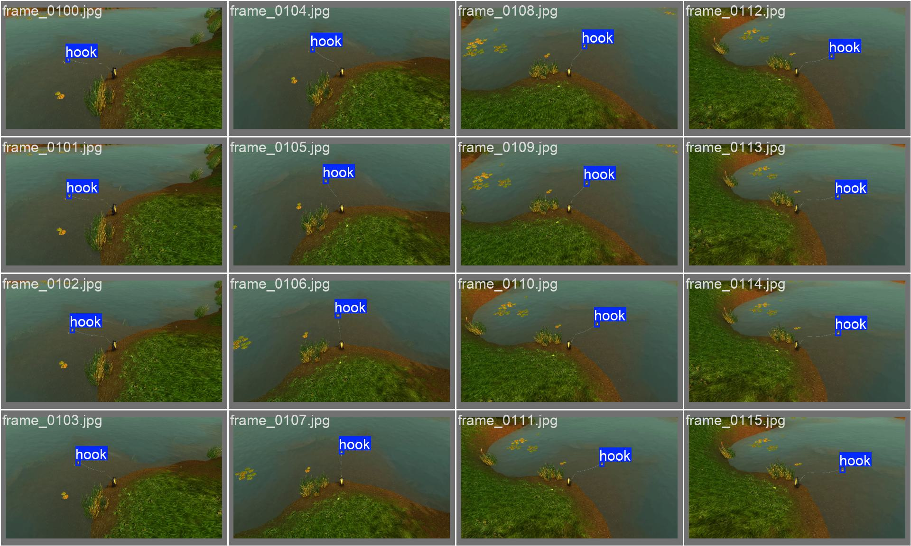
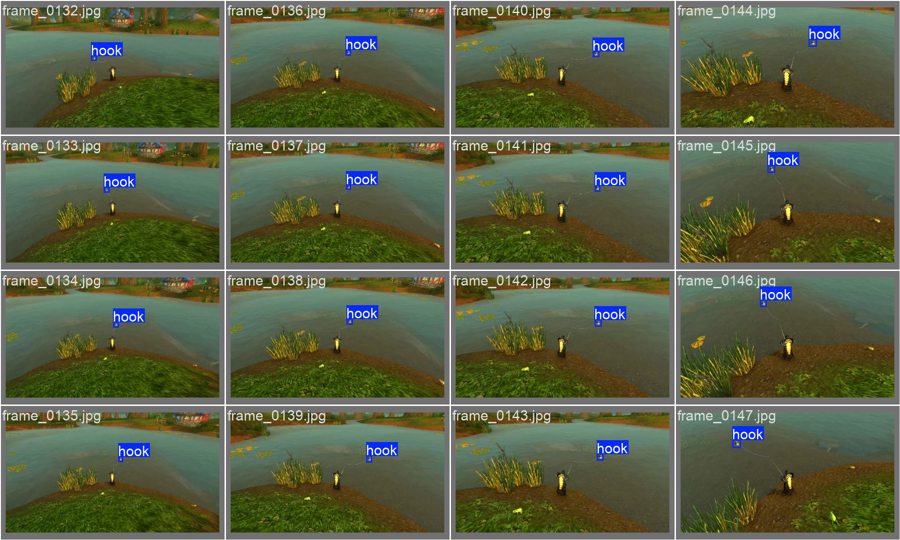

<div align="center">
    <h1 style="font-size: large; font-weight: bold;">Masterfisher</h1>
    <a href="#">
        
    </a>
    <a href="#">
        
    </a>
  <br>
</div>

> ⚠️ **Warning :** Please note: this project contains neither code nor templates to protect WoW from botting, even if other solutions exist.



## Presentation

This project is fishing bot for **WoW** game, fishing in a completely automatic way, mouse clicks and movements will only be done in the game and will not need any human intervention. If required, you can view what the bot is doing via a web page.


Here's the result of training on a dataset of ~200 images over 50 epochs with an imgz of 600

### Dataset analysis

Labels information (position, size and class)



Labels histogram (correlogram)



### Model training

Model training F1-confidence curve



Model training precision-confidence curve



Model training precision-recall curve



Model training recall-confidence curve



General model training results



### Visualisation

Validation batch `0`



Validation batch `1`



## Installation

This project requires `conda` to be installed. To install the dependencies, simply run the following command:

```bash
conda env create -f environment.yml
```

You can update the environment with the following command:

```bash
conda env update -f environment.yml
```

## Usage

To run the project, you can use the following command:

```bash
python src/masterfisher/
```

## Structure

```bash
├── src               # Project source code
├── docs              # Project documentation
│   └── static        # README.md static files
├── tests             # Folder containing software tests
│   ├── units         # Unit tests
│   └── integrations  # Integration tests
├── scripts           # Useful scripts for the project (no CI/CD)
├── ruff.toml         # Ruff configuration file
├── environment.yml   # Conda environment configuration file
```
